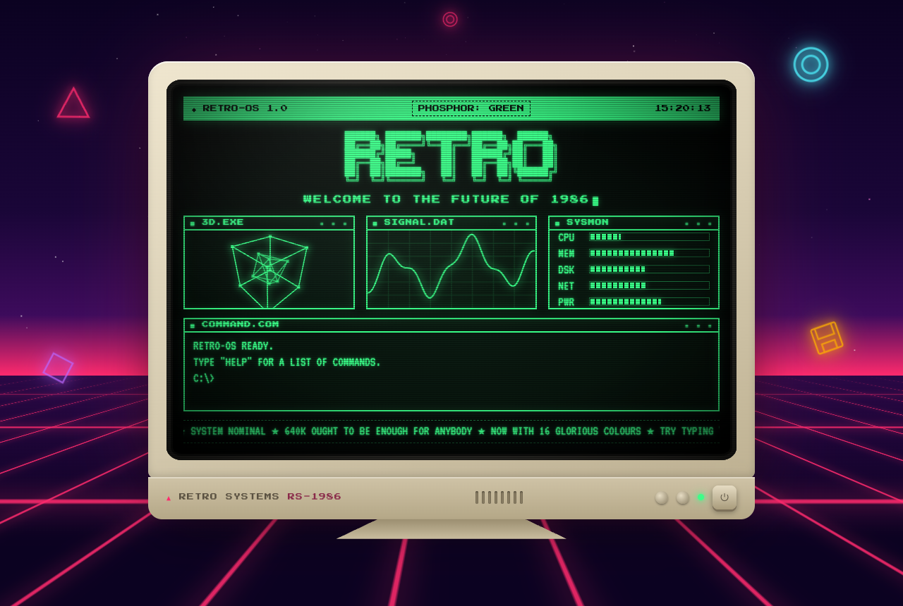

# RETRO-OS

A retro CRT computer in your browser — a beige 1986 monitor glowing in front of a synthwave sunset.

**[▶ View it live](https://retro.ross-dev.workers.dev/)**

[](https://retro.ross-dev.workers.dev/)

## Features

- **Boot sequence** — BIOS checks type out line by line, then a loading bar (press any key to skip)
- **CRT effects** — phosphor glow, scanlines, a rolling refresh bar, subtle flicker and a power-on/off squash
- **Live screen** — a spinning wireframe cube, an oscilloscope signal, system meters, a clock and a scrolling ticker
- **Working terminal** — type commands at the `C:\>` prompt (↑/↓ for history)
- **Phosphor colours** — switch between green, amber and cyan
- **Power button** — turn the monitor off and on to watch it reboot
- **Synthwave backdrop** — a starfield, a striped neon sun, a scrolling grid floor and floating shapes
- Respects **reduced motion** settings

## Terminal commands

| Command | What it does |
| --- | --- |
| `help` | List all commands |
| `about` | About this machine |
| `date` | Current date and time |
| `color green` / `amber` / `cyan` | Change the phosphor colour |
| `fortune` | Wisdom from the mainframe |
| `echo <text>` | Repeat after me |
| `clear` | Clear the screen |
| `reboot` | Restart the system |

## Built with

[React](https://react.dev/) · [Vite](https://vite.dev/) · [Tailwind CSS](https://tailwindcss.com/) · hosted on [Cloudflare Workers](https://workers.cloudflare.com/)

## Running locally

```bash
npm install
npm run dev      # dev server at http://localhost:5173
npm run build    # production build in dist/
npm run lint     # lint with Oxlint
```
